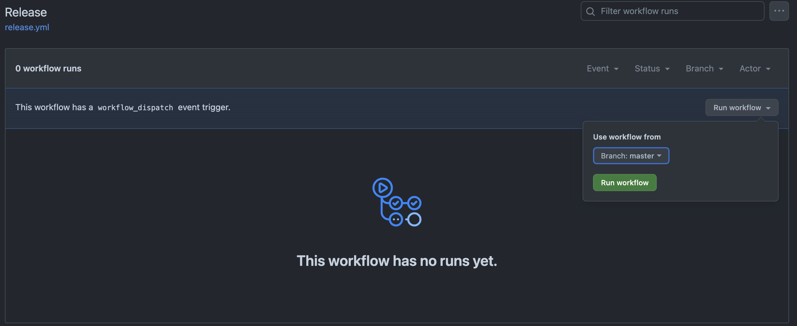

`vidahealth/release` Custom Github Action
===

> Automate creating a release candidate branch

## What does it do?
* checks out `release`
* gets the commit hash from `master`
* cuts a new branch as `release-${hash}` from `release`
* merges `master` in the new branch
* tags and pushes the new branch

## How do I use it?
Create `.github/actions/release` in your repository with the following contents:

```yaml
name: 'Release'

on: workflow_dispatch

jobs:
  release:
    runs-on: ubuntu-latest
    steps:
      - name: Release
        uses: vidahealth/release@main
```

To run it in the repository, navigate to Actions:

